<!-- Header Section -->

  

<!-- Animated Subtitle -->

  

---

### 👋 About Me

I'm a college student on an exciting journey exploring the wide universe of technology! I live for **vibe coding**, experimenting with **AI**, crafting interactive **frontend** experiences, and playing around with anything that catches my curiosity. 🌟

* 🔭 **Currently exploring:** Frontend frameworks, AI agents, and cool UI designs.
* 🌱 **Learning:** Python, TypeScript, and pushing the boundaries of AI-assisted development.
* ⚡ **Fun Fact:** I believe the best code is written when the music is loud and the vibes are just right! 🎧

---

### 🛠️ My Tech Stack & Tools

  <!-- Languages -->
  
  
  
  
  

  <!-- Frameworks & Ecosystem -->
  
  
  
  
  

---

### 📊 GitHub Stats & Vibe Check

  

 

  

---

  Let's connect, share ideas, and vibe code together! ✨ 
  <b>Happy Coding! 🚀</b>

